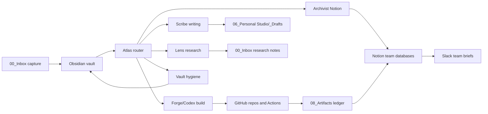

# Lua v4 Operating Architecture

## Goal

Lua는 개인 지식, 팀 운영, 앱 제작을 하나의 연결 머리로 묶는 AI 운영체제다. Obsidian은 생각과 맥락의 원장이고, GitHub는 변경 이력과 실행 코드의 원장이고, Notion은 팀이 보는 운영 데이터베이스이며, Slack은 팀에게 전달되는 신호 채널이다.

이번 v4의 목표는 도구를 더 늘리는 것이 아니라, 각 도구가 맡는 일을 분명하게 나누고 모든 작업이 검증 가능한 루프로 흐르게 만드는 것이다.

## Reference Inputs

- ZeroCho TV 영상 요약: OpenAI Codex로 시간 관리 앱을 직접 만들며, 프로젝트별 하네스 설정, Superpowers식 기획-설계-TDD-보안 점검 루프를 보여준다.
- `obra/superpowers`: 브레인스토밍, 계획, 워크트리, TDD, 리뷰, 마무리 절차를 스킬로 강제하는 개발 하네스 패턴.
- `garrytan/gstack`: 브라우저 기반 작업, Office Hours식 문제 재정의, 역할별 AI 스킬, 팀 공유 규칙을 묶은 운영 패턴.
- `artifact-keeper`: 빌드 산출물, 모델, 배포 파일, 분석 결과 같은 artifact를 별도 원장으로 보관하는 패턴.

## System Map



## Tool Responsibilities

| Tool | Primary role | Should not do |
|---|---|---|
| Obsidian | Source of truth for context, thinking, project memory, agent prompts | Become a public/team reporting UI |
| GitHub | Versioned code, scripts, app repos, checks, issue/PR history | Store private secrets or raw team chatter |
| Notion | Team-facing project database, decision log, artifact index | Replace Obsidian as the private thinking graph |
| Slack | Delivery channel for briefs, blockers, decision requests | Become the canonical project database |
| Claude on Mac | Planning, synthesis, writing, Notion curation | Final deterministic code verification |
| Codex on Windows | Code edits, scripts, tests, local app verification | Send external messages without approval |

## Core Loops

### 1. Capture Loop

Telegram, Slack, meeting notes, browser research, and spontaneous ideas enter `00_Inbox/`. Vault or Atlas classifies each item into a project, resource, operation, or archive destination.

Command: `/inbox-triage`

### 2. Office Hours Loop

Before making an app or service, Atlas runs a short product interrogation:

1. Who is the user?
2. What painful moment are we removing?
3. What will exist after 7 days?
4. What should we refuse to build first?
5. What proof would make this worth continuing?

Command: `/office-hours {idea}`

### 3. Build Harness Loop

Forge/Codex handles implementation with a Superpowers-style loop:

1. Define goal and acceptance criteria.
2. Read existing code and constraints.
3. Make a small plan.
4. Implement the smallest useful slice.
5. Run checks and tests.
6. Review security, secrets, and data exposure.
7. Log next action.

Command: `/project-sprint {project} {goal}`

### 4. Knowledge Sync Loop

When a meaningful decision, artifact, or project state changes:

1. Obsidian note is updated first.
2. Notion receives a concise team-facing mirror.
3. Slack receives a brief only when someone needs to know or decide.

Command: `/team-brief {project}`

### 5. Artifact Loop

Any reusable output gets an artifact record:

- app build or demo URL
- proposal draft
- patent draft
- dataset or analysis file
- generated report
- design screenshot
- prompt/skill bundle

Command: `/artifact-log {name}`

## Repo Structure Changes

Keep the existing seven core zones. Add two lightweight zones:

```text
08_Artifacts/
  Artifact Ledger.md
  README.md

09_Automations/
  README.md
  GitHub Actions.md
  Notion Sync.md
  Slack Briefs.md
```

Reasoning:

- `08_Artifacts` gives you the useful part of Artifact Keeper now without operating another service too early.
- `09_Automations` keeps cron jobs, GitHub Actions, Notion syncs, Slack briefs, and future MCP jobs from being scattered.
- Full Artifact Keeper becomes useful later when artifact volume, retention, permissions, or deployment environments become hard to track in Markdown.

## Agent Model

The agent names should be stable even if model providers change.

| Agent | Job | Default host |
|---|---|---|
| Atlas | route, ask Office Hours questions, sequence work | Claude or Codex |
| Lens | research and source comparison | Claude |
| Scribe | writing, proposals, patent drafts | Claude |
| Forge | coding, refactors, tests, local apps | Codex |
| Vault | Obsidian hygiene | Claude or Codex |
| Archivist | Notion mirror and database curation | Claude |
| Courier | Slack brief drafting and delivery checklist | Claude |
| Steward | security, cost, permission review | Codex |

Do not bind the architecture to a specific model name. Bind it to capability, context window, tool access, cost, and verification need.

## Notion Databases

Minimum useful Notion setup:

| Database | Mirrors from Obsidian | Key fields |
|---|---|---|
| Projects | `02_Projects/**/Home.md` | Status, owner, next action, deadline, Slack channel |
| Decisions | Command Center and project DevLogs | Decision, date, context, reversible, owner |
| Artifacts | `08_Artifacts/Artifact Ledger.md` | Type, project, path/url, status, reviewer |
| Proposals | `03_Operation/Proposals/` | Grant, deadline, stage, blocker |
| Patents | `03_Operation/Patents/` | Title, stage, attorney review, prior art status |

## Slack Channels

Start with a small channel map:

| Channel | Purpose |
|---|---|
| `#ai-briefings` | weekly summaries, agent output summaries, decision requests |
| `#project-{slug}` | project-specific blockers and ship notes |
| `#ops-alerts` | failed syncs, broken automations, urgent reminders |

Slack messages should be staged as drafts first until the team trusts the format.

## Artifact Keeper Decision

Use a lightweight artifact ledger now. Add a full artifact system later when at least two of these are true:

- multiple people need to retrieve build artifacts without asking you
- app builds, reports, datasets, and prompt bundles need retention rules
- artifacts need permission tiers or audit trails
- deployments need reproducible provenance
- file size or binary volume makes GitHub/Obsidian awkward

Until then, `08_Artifacts/Artifact Ledger.md` plus GitHub releases or repo paths is enough.

## First 30 Days

1. Make Codex entry real: add `AGENTS.md`, make `node scripts/check.js` dependency-free, and keep checks green.
2. Replace `Harness Loop.md` with the actual operating loop.
3. Add `/office-hours`, `/project-sprint`, `/team-brief`, and `/artifact-log` command docs.
4. Add `08_Artifacts` and `09_Automations`.
5. Pick one app project and run a full loop from Office Hours to local demo.
6. Mirror only the project dashboard and decision log to Notion.
7. Send Slack briefs manually first, then automate once the wording is trusted.

## Definition of Done

The system is working when:

- a new idea can enter Inbox and become a project without losing context
- a project can become a coded app through Codex with checks attached
- a decision can be found in both Obsidian and Notion
- a team member can understand status from Notion or Slack without opening Obsidian
- artifacts have a stable path, owner, status, and review state
